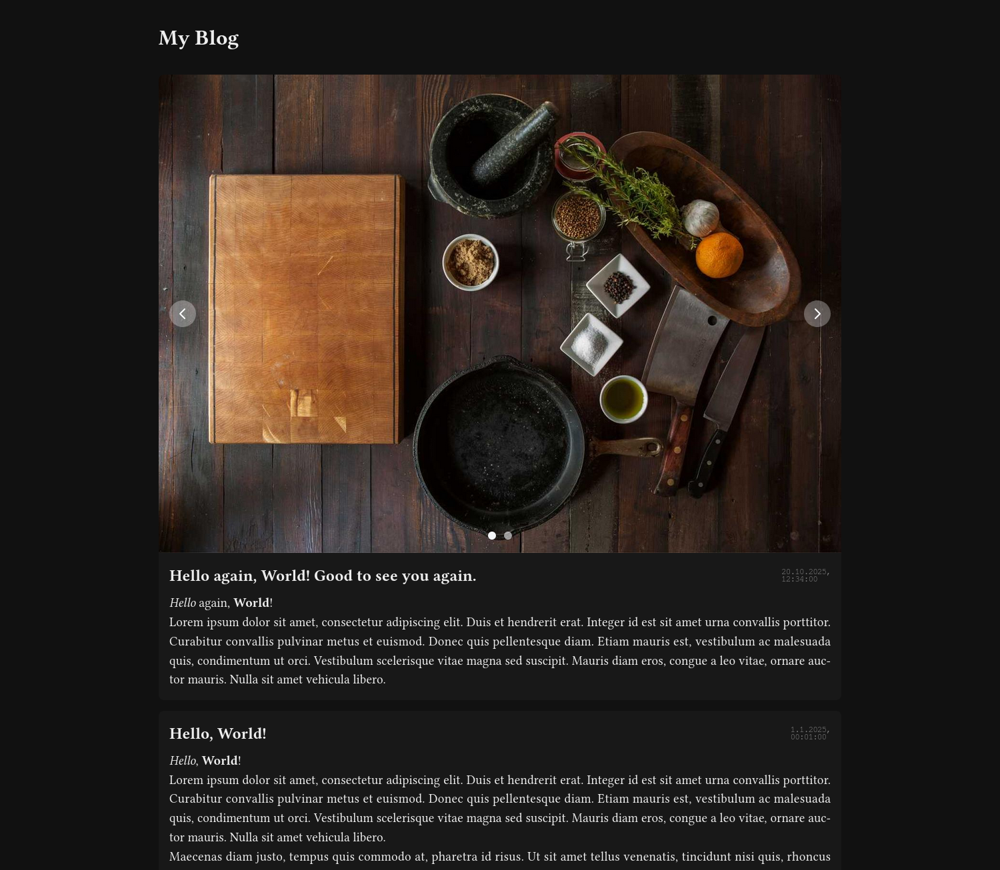

# Blog

This is a simple blog service that just works.
There are great alternatives with a lot more functionality but sometimes, all you need is a simple service that serves Markdown files in the style of a blog.



## Installation


### From the GitHub Container Registry

To run the application using Docker:
```bash
sudo docker run -d -p 3000:3000 -v $(pwd)/content:/app/content -e NODE_ENV=production -e HOST=0.0.0.0 ghcr.io/itschotsch/blog:latest
```

### From source

To run the application using Docker Compose:
```bash
sudo docker compose up -d
```

To run the application using Docker:
```bash
sudo docker build -t blog .
sudo docker run -d -p 3000:3000 -v $(pwd)/content:/app/content -e NODE_ENV=production -e HOST=0.0.0.0 blog
```

To run the application using PNPM:
```bash
pnpm build && pnpm preview
```

## Usage

To create a post, create a Markdown file in `content/posts`.
Optionally, include a frontmatter for metadata in YAML syntax.

For example, `content/posts/HelloWorld.md` may look as follows:
```markdown
---
title: Hello, World!
datetime: 2025-01-01 00:01
images:
  - src: example.png
    alt: Example image
    title: Example image
---

*Hello*, **World**!
```
Images referenced with relative paths such as `example.png` in the example above should be placed in `content/media`.

### Customisation & Styling

In `content/configuration.yaml`, you can make some customisations:
- `title`: The title of your blog, which is displayed at the very top of the page as well as on the tab.
- `language`: The language code of your blog, which is used in the `<html lang="%lang%">` tag and affects the text hyphenation.
- `stylesheets`: A list of stylesheets to be used. These can be absolute URLs for CDNs or relative URLs for CSS files placed in `content/style`.

## Development

This application is written in SvelteKit / Svelte 5.

Install the dependencies with `pnpm install` and start a development server:

```bash
pnpm dev
```

To build a production version of the app:

```bash
pnpm build
```

You can preview the production build with `pnpm preview`.
